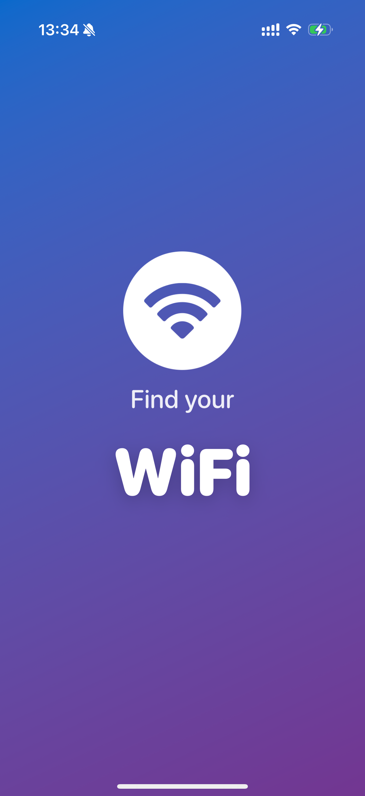
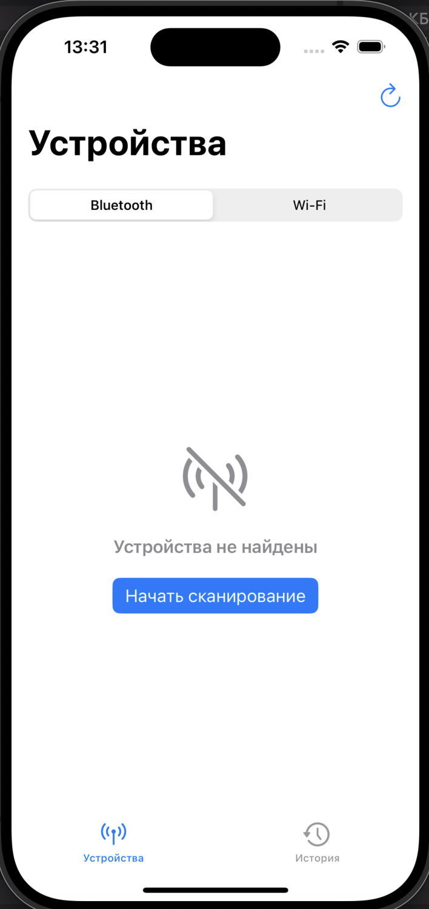
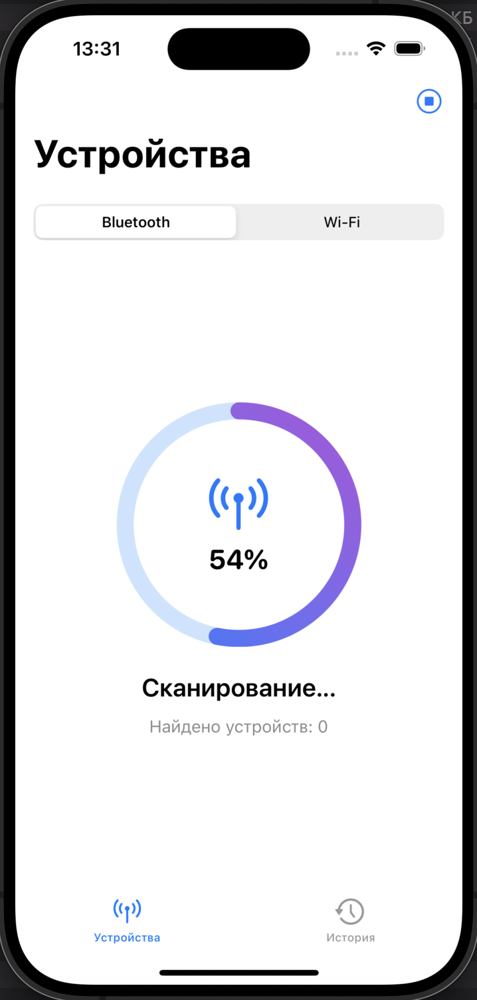
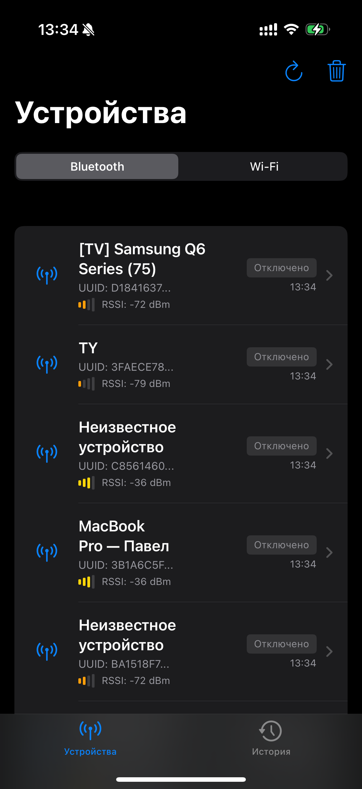
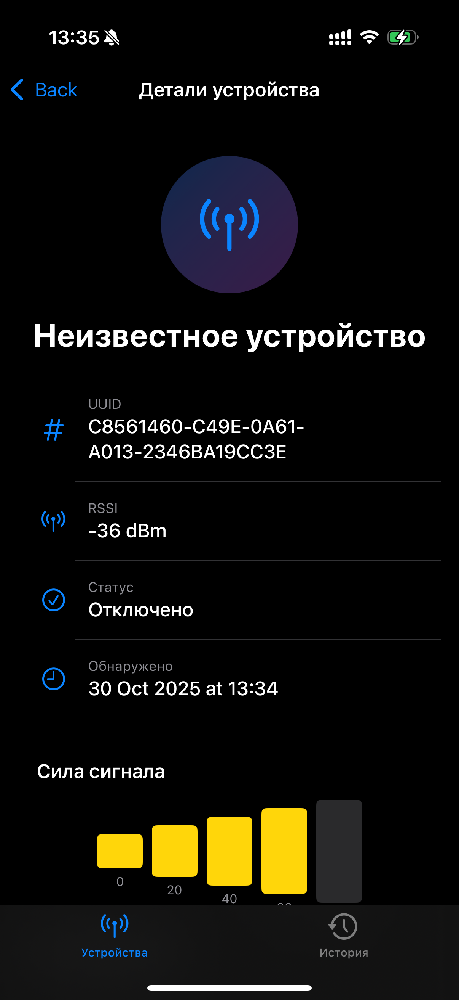
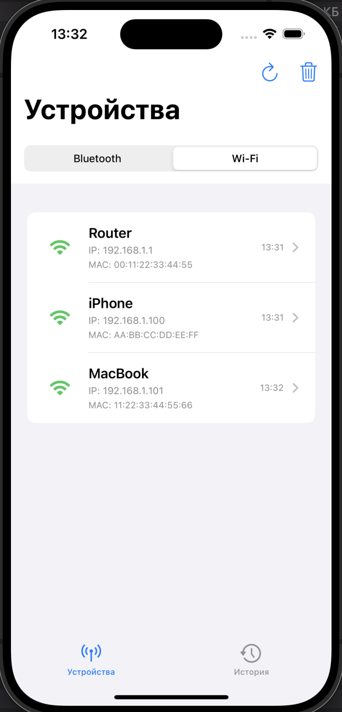
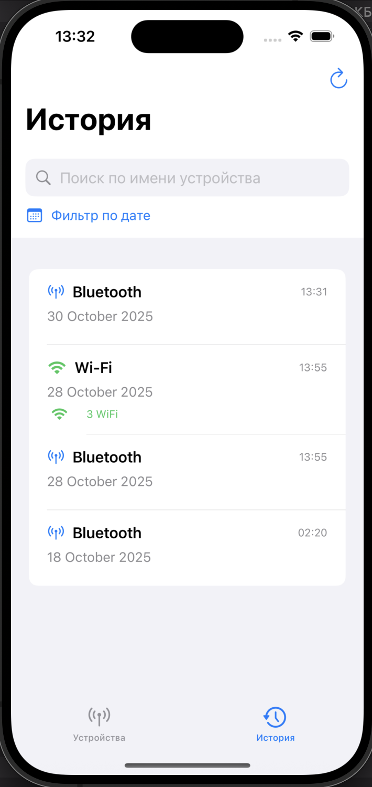
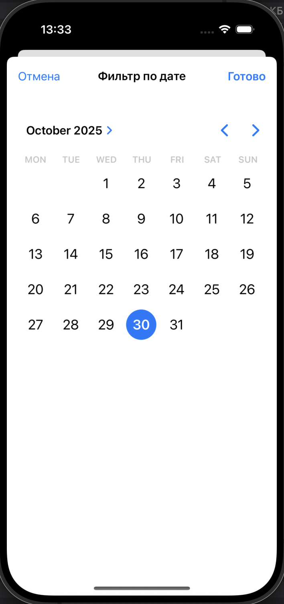
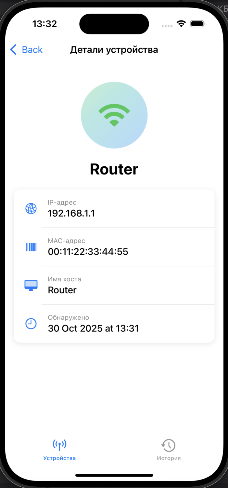

# FindYourWifi

🔎 Project Overview

FindYourWifi is an iOS app built with SwiftUI + UIKit that scans for nearby Wi-Fi and Bluetooth devices, displays scan progress in real time, and saves discovered devices into session history.
The app uses a Coordinator pattern to manage navigation flow and a SwiftUI-based UI for flexible, modern interface composition.

✨ Key Features

 - Scan for both Bluetooth and Wi-Fi devices with a segmented toggle.
 - Animated scan progress visualization (each scan runs ~15 seconds).
 - Detailed device list with signal strength, IP, MAC, and timestamps.
 - History of scan sessions with search and date-based filters.
 - Device detail screen for additional information.
 - Smooth launch transition (custom Launch Screen → TabBar).
 - Supports iOS 15 and above.

🧩 Technologies & Tools

Built using:\
🛠 SwiftUI \ UIKit
🧭 Navigation: Coordinator (UIKit) + NavigationView (SwiftUI for iOS 15)\
🧩 UI Frameworks: SwiftUI for screens, UIKit for app lifecycle and root coordination\
📦 Dependency Management: CocoaPods (optional)\
📱 Minimum Target: iOS 15.0\
🔋 Hardware APIs: CoreBluetooth + Network interfaces for scanning\
🧪 Debugging & Profiling: Xcode Instruments, Memory Graph Debugger\
🗃 Data Handling: CoreData \
🧭 Icons: SF Symbols\
⚙️ Architecture: MVVM + Coordinator + Protocol-driven composition\

🏗 Architectural Decisions

The app follows a modular MVVM + Coordinator structure:\
 - Coordinator pattern handles the root flow (Launch → TabBar), ensuring smooth screen transitions and no double navigation stacks.
 - SwiftUI drives the main user interface, keeping layouts declarative and responsive across devices.
 - ViewModels manage business logic and expose data through @Published or callback bindings, simplifying testing and state management.
 - This setup enables a clean separation of UI and logic layers, while maintaining flexibility for future module expansion (e.g., login flow, settings).

📜 License

This project is licensed under the MIT License — feel free to use, modify, and distribute with attribution.

<table> <tr> 
  <td></td> 
  <td></td> 
  <td></td> 
  <td></td> 
  <td></td> 
  <td></td>
  <td></td>
  <td></td>
  <td></td></tr> </table>
